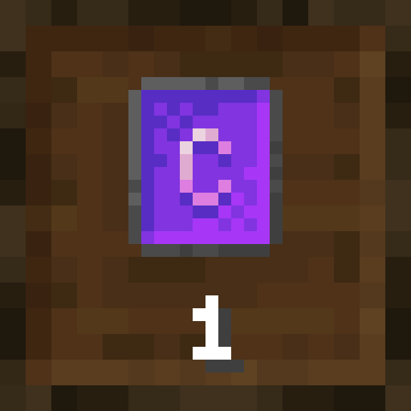

# Functional Storage: Creative Limiter



A small Forge 1.20.1 add-on for [Functional Storage](https://www.curseforge.com/minecraft/mc-mods/functional-storage) that lets
pack makers pick items the **Creative Vending Upgrade** won't make infinite.

## Download

Get the latest version from the **[Releases page](https://github.com/Knozyy/functionalstorage-creative-limiter/releases/latest)**:

- **`fscreativelimiter-<version>.zip`**: the mod and its default config. Extract it into your instance folder
  (the one containing `mods` and `config`) and both files land in the right place.
- **`fscreativelimiter-<version>.jar`**: the mod on its own. Drop it into `mods`; the config is created on first launch.

Requires [Functional Storage](https://www.curseforge.com/minecraft/mc-mods/functional-storage) 1.20.1-1.2.0 or newer.

## Why

A drawer with the Creative Vending Upgrade hands out an endless supply of whatever it holds. Packs that put the upgrade
in the endgame have a problem: a player can store a Creative Vending Upgrade in a creative drawer and pull out as many as
they like, along with any other item the pack wants to keep scarce.

With this add-on, listed items can still be stored and upgraded as usual; a creative drawer just keeps their real amount.
Put one in, get one back.

## Config

`config/functionalstorage/functionalstorage-creative-limiter.toml`, created on first launch:

```toml
[DrawerFilter]
	blockedItems = ["functionalstorage:creative_vending_upgrade"]
```

| Entry | Matches | Example |
|---|---|---|
| `"modid:item"` | a single item | `"minecraft:diamond"` |
| `"#namespace:tag"` | every item in a tag | `"#forge:ingots/iron"` |
| `"modid:*"` | every item of a mod | `"mekanism:*"` |

- Press **F3 + H** in game for advanced tooltips; hovering an item then shows its id.
- Changes apply as soon as the file is saved. `latest.log` prints a `Creative Limiter list loaded` line with the counts.
- Normal and ender drawers decide per slot: only the listed item stops being infinite.
- Compacting drawers stop being creative entirely if any tier of their chain is listed, so an infinite allowed tier
  (nuggets) can't be crafted into a listed one (ingots).

## Compatibility

- Minecraft 1.20.1, Forge 47+
- Functional Storage 1.20.1-1.2.0 or newer (tested on 1.2.10 and built against 1.2.14)
- Needed on both client and server.

It doesn't replace or edit the Functional Storage jar; a few Mixin redirects swap its `isCreative()` checks. If a
future Functional Storage update changes those methods the game stops at startup with a clear Mixin error instead of the
limit silently switching off.

## Building

The Gradle project lives in `source/`. Needs JDK 17.

```
cd source
./gradlew build
```

The jar ends up in `source/build/libs/`.

## License

MIT. The logo is made from Functional Storage textures by Buuz135 and Rid, used under Functional Storage's MIT license.
